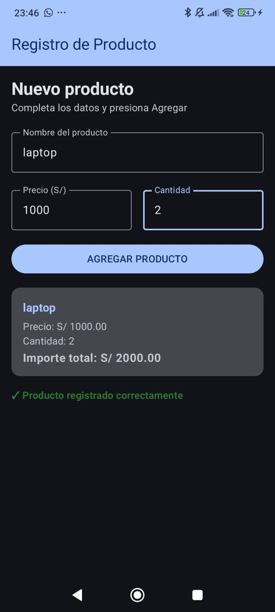

# Laboratorio 03: Registro de Producto con Jetpack Compose

**Estudiante:** Ian Alexander Rau Reyes
**Curso:** Programación en Móviles - 4to Ciclo  
**Institución:** Tecsup

## Descripción del Proyecto
Construcción de una interfaz reactiva utilizando Jetpack Compose que implementa controles de ingreso (`OutlinedTextField`), acción (`Button`) y visualización (`Text`, `Card`). La gestión del estado en pantalla se realiza mediante `remember` y `mutableStateOf`, garantizando la persistencia de datos durante la recomposición.

---

## Evidencias Visuales

---

**¿Qué pasaría si declaras las variables de los campos SIN `remember`?**

Sin `remember`, las variables perderían su valor y se reiniciarían cada vez que la pantalla se vuelva a dibujar (recomposición). Como resultado, el texto ingresado por el usuario se borraría al instante y no se podría escribir en los campos.

